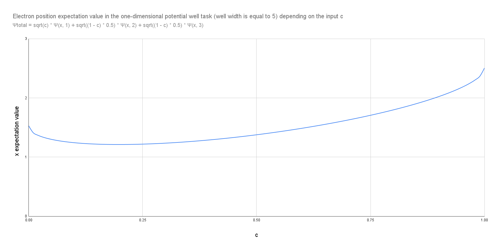

# proxima

An exploratory project for accelerating quantum systems simulation by performing approximate computations via artificial intelligence methods.





## Building

The following command must be executed for packaging the project contents:

```sh
swift build --product proxima
```

## Usage

The main executable may be launched after the compilation has finished via the following simple command:

```sh
 ./.build/debug/proxima
```
